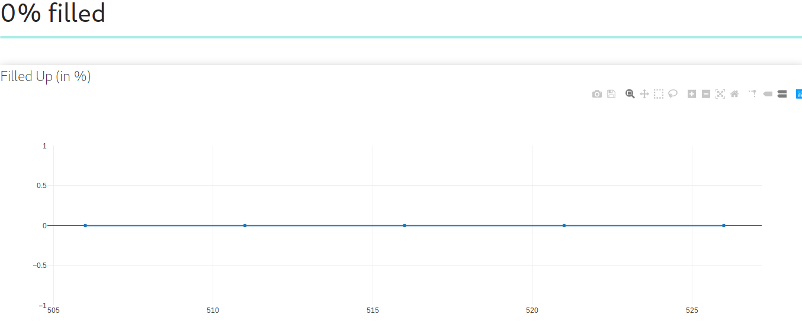

# Aavishkar IOT Hackathon

This is the demo of the frontend:

To view the demo of how the dustbin sweeps the waste and picks it up on its own click [here](
https://drive.google.com/open?id=1lRRQbL9k4dgNGdNXnpt4H-QnX99c0k9T).

## Building

>Note that depending on your machine you may have to use **pip3** instead of **pip** and **python3** instead of **python**.

>Its best to use the `virtualenv` tool to build locally. Install virtualenv by running `pip install virtualenv`

>Then create a virtual environment by `virtualenv <your env name>`

>Activate the virtual environment by `source <your env name>/bin/activate`

>Deativate the virtual environment by running `deactivate` in your terminal.

 * First install the required modules by running `pip install -r requirements.txt`

 * Then run `python manage.py runserver <port no>`

 Go to `localhost:<port no>/datavis` and the site should be live!

## The Project

This project is for the IoT hackathon. We have developed a smart and fully remote dustbin for smart waste management and disposal which can be monitored and controlled from anwhere in the world. We do not even have to monitor it as well, it 
regularly sends us notification regarding its status, _i.e_ how much it is filled.

## Uniqueness of the idea

This projects is a unique, effective, extremely cost effective, low cost and remote solution for smart waste management and smart waste disposal. There is smart car, smart home automation, smart watch but rarely a smart dustbin (who thought to make a dustbin smart?:wink:). Anyways, with our idea, the dustbin will pick up waste from its vicinty and dump it and also sends notifications to clear it when filled. Also there will always be a status indicator LEDs in the dustbin so that people can understand the status of the dustbin, _i.e._, whether it is filled or empty or half filled. In future, it will be a part of a distributed network so that an entire city or place can be covered in our network and we can keep the city clean. Not only that, this remote dustbin can be controlled from anywhere in the world. We do not even have to monitor it as well, it regularly sends us notification regarding it status, _i.e._, how much it is filled.

## Target

Schools, colleges, offices, parks, municipalities and anywhere and everywhere there is waste you can implement our solution.
We can use our smart dustbin to effectively monitor waste management with full automation thus saving huge man hours and also
keeping the environment clean.

## Equipments Required

1. Arduino - 1 in quantity
2. NodeMCU - 1 in quantity
3. Servo motor - 2 in quantity
4. LEDs
5. Connecting wires

## Cost Effectiveness of the Idea

This is the ultimate low cost solution to a smart dustbin. We are using the cheapest of all microcontrollers, _i.e._, Arduino board. Also we use NodeMCU for the communication which is also very cheap. Most importantly, we are not using any 3rd party cloud (like conventional Thingspeak, Dtweet for storing our data). We have used free google sheet to store our data and then developed our own frontend to visualize and analyze the data with django.

## Hardware Design and Implementation

- First, we use ultrasonic sensor to find out how much the dustbin is filled. The sensor sends the data to Arduino which in turn 
sends it to the NodeMCU. The arduino will light up the status indicators accordingly as the dustbin is filled. The NodeMCU
send the data to Google spreadsheet (YES we do not use any 3rd party and readymade API).
- Next using Google's API we take the  data from the Google spreadsheet and visualizze it using our own frontend. We have built a web app using Django where all the collected data will be analysed and visualized. Depending on the levels of the dustbin the admin will get notifications in his/her email. The dustbin can be monitored and controlled sitting anywhere in the world.

The dustbin can also pick up waste in its own. For that we have used a servo motor to pick up waste by sweeping the ground and another servo moto picks it up and dumps it in the dustbin.

## Market Saleability

This is the cheapest solution anyone can get in the market. Within around 700 rupees we can get an fully automated and remote 
solution which can be controlled sitting from anywhere in the world. We do not even have to monitor it as it will send us
notifications describing it's status. Now who does not want such a world class solution for so less rupees for a daily work?

## Future Plan

1. Making the remote dustbin part of a distributed network so that an entire city or place can be covered in our network;
2. Sending text messages and web notifications as soon as any dustbin in the network is going to be filled;
3. Using Machine learning and data analysis in our collected data to predict results for the future;
4. Using image processing to scan the vicinity and pick up waste in its own;
5. Introducing custom features as per our customers.

## Team Members

1. [Sarnava Konar :octocat:](https://github.com/sarnava1)
2. [Ayan Banerjee :octocat:](https://github.com/ayan-b)
3. [Revanth Reddy :octocat:](https://github.com/revanth-reddy)
4. [Sai Vara Prasad :octocat:](https://github.com/Saivaraprasad)

## License
    
The repository is under MIT License. See the [LICENSE](./LICENSE.md) file for more info.
